# Book-Management-System
# 📚 Book Management System

A simple web-based Book Management System that allows users to manage books, track inventory, and handle billing operations. Designed for small libraries, bookshops, or personal collections.

[This Project are under in Implement not Finished]

## 🚀 Features

- 📘 Add, update, and delete book records
- 📦 Manage stock and availability
- 🧾 Generate bills for customers
- 🔍 Search and filter books by name, author, or category
- 📊 GST-based billing system (UNDER IMPLEMENT)


## 🛠️ Technologies Used

- **Backend:** Django 
- **Frontend:** HTML, CSS, JavaScript
- **Database:** SQLite
- **Others:**Git and Version Control,vercel

## 🚀 Installation & Setup
Follow these steps to run the project locally:

1. Clone the Repository 
```bash 
    git clone https://github.com/GOKUL988/Student-mark-management-in-Django.git 
    cd Student-mark-management-in-Django 
```
2. Install Dependencies 
```bash 
    pip install -r requirements.txt 
```
3. Apply Migrate 
```bash 
    python manage.py migrate  
```
4. Run the Application 
```bash 
    python manage.py runserver  
```

## samples 
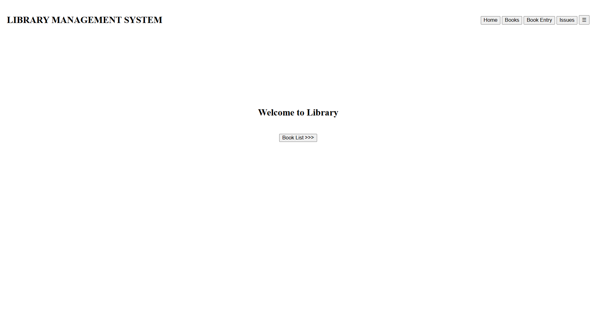 
#
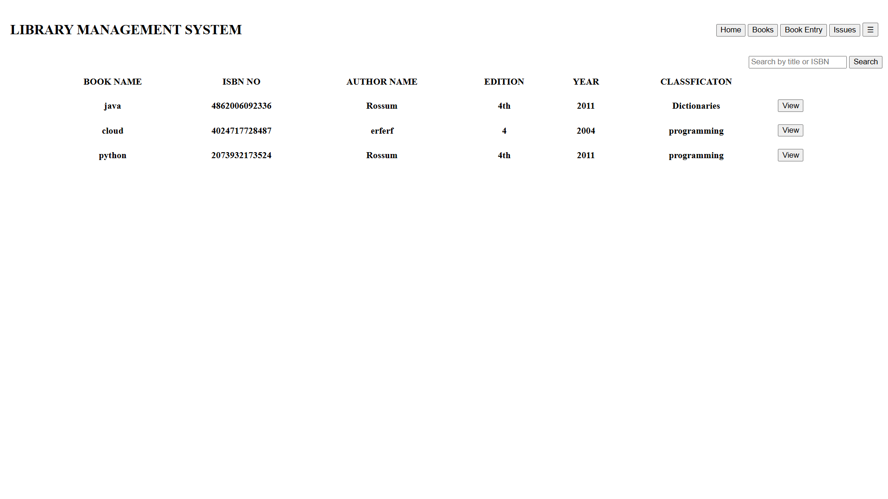 
#
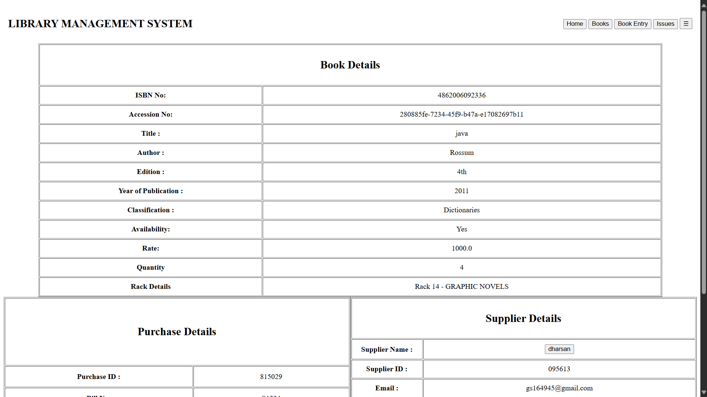 
#
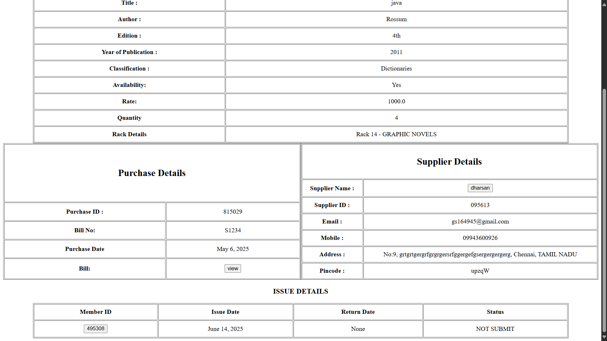 
#
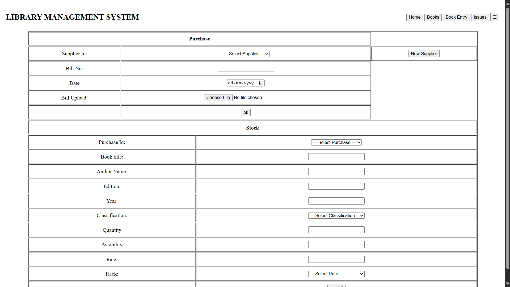 
#
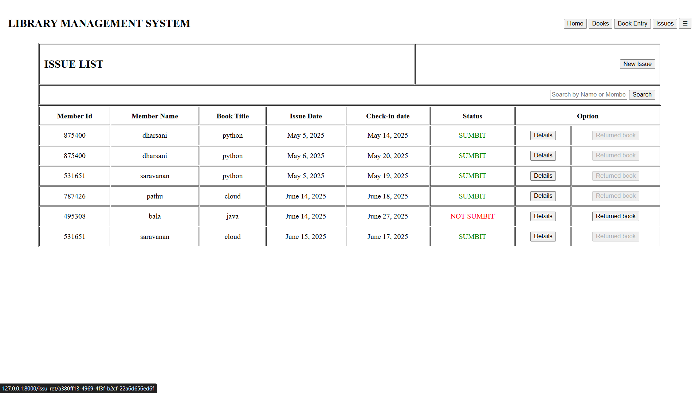 
#
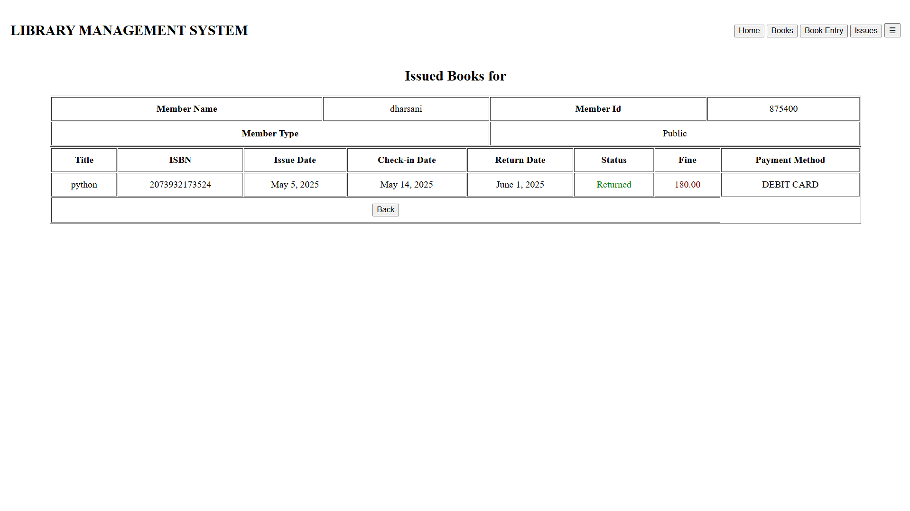 
#
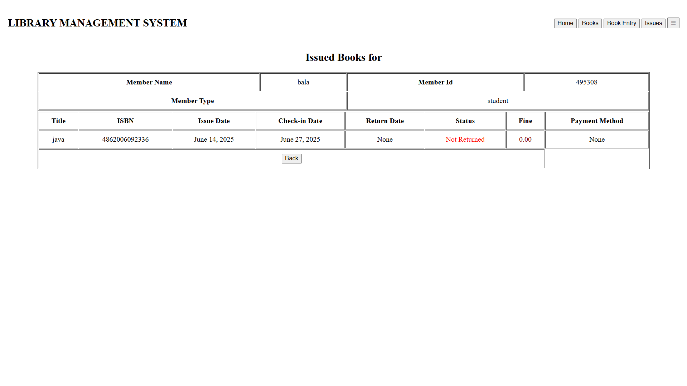 
#
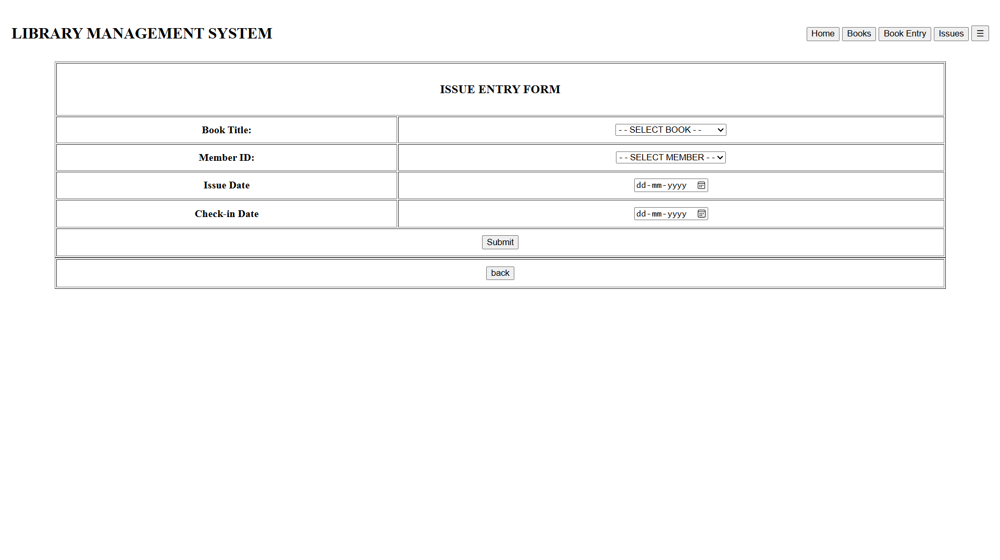 
#
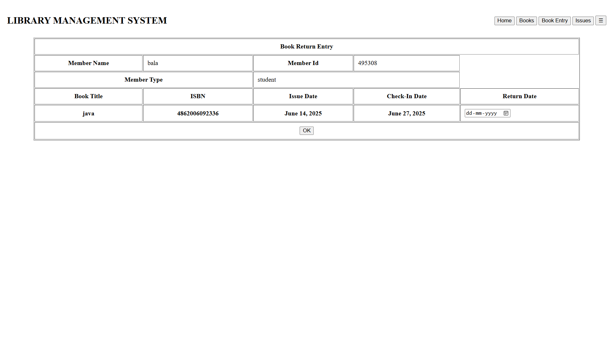 
#
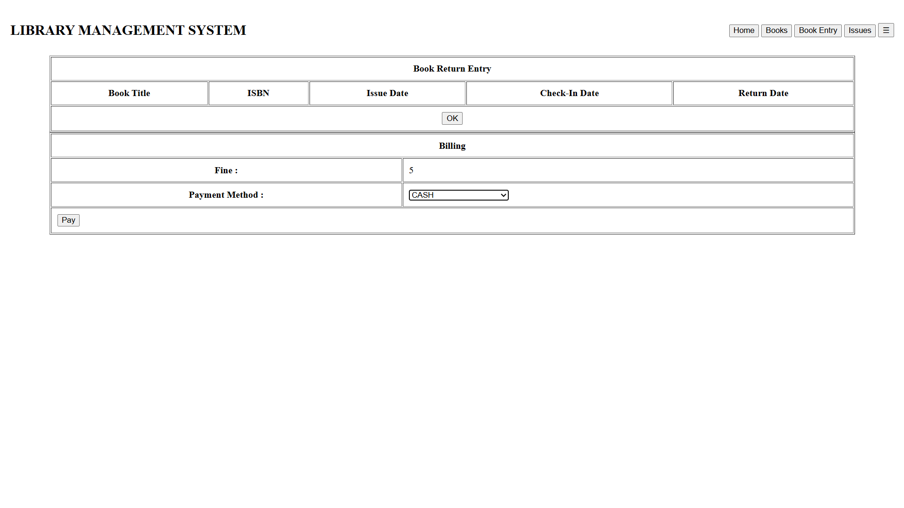 
#
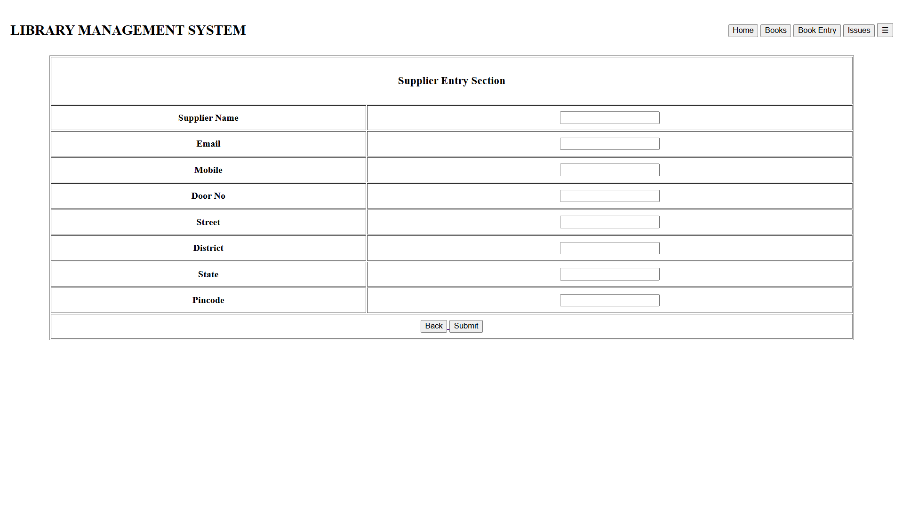 
#
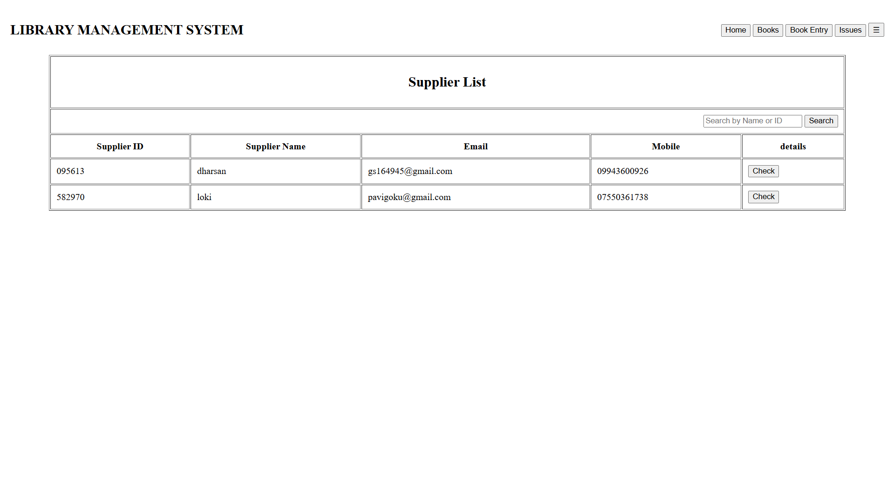 
#
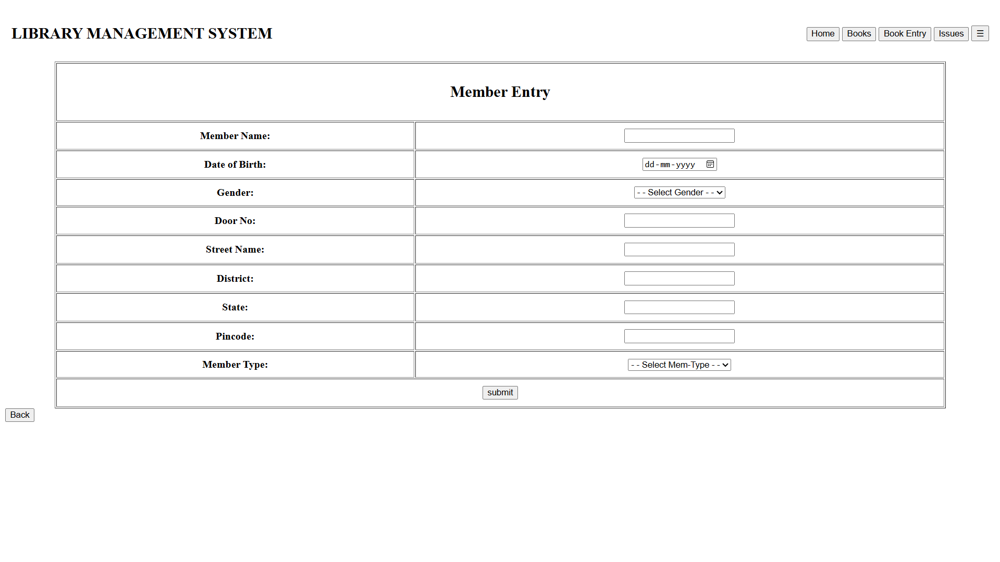 
#
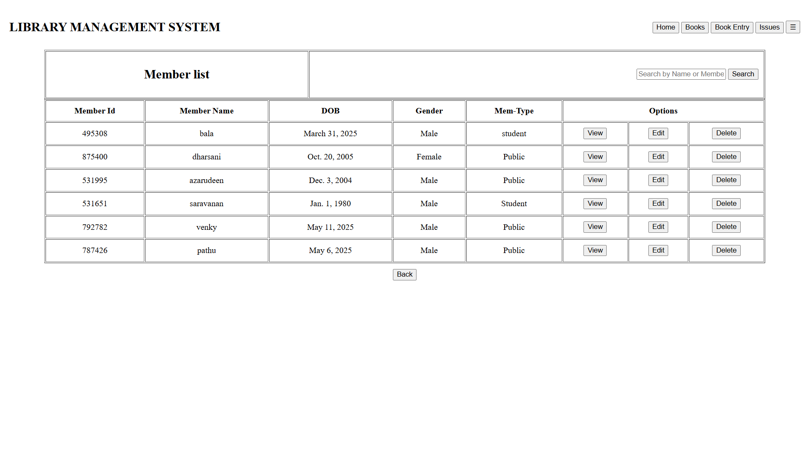 
#
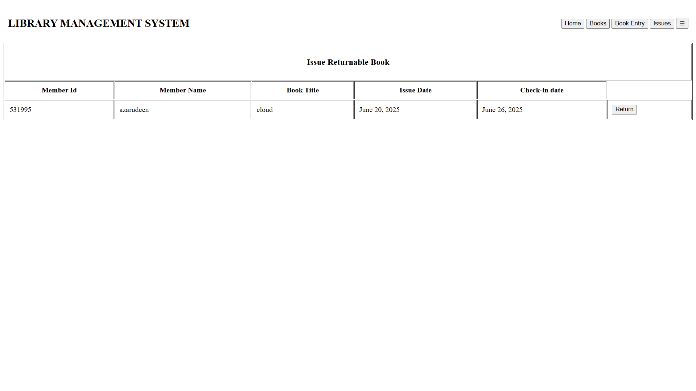 
#
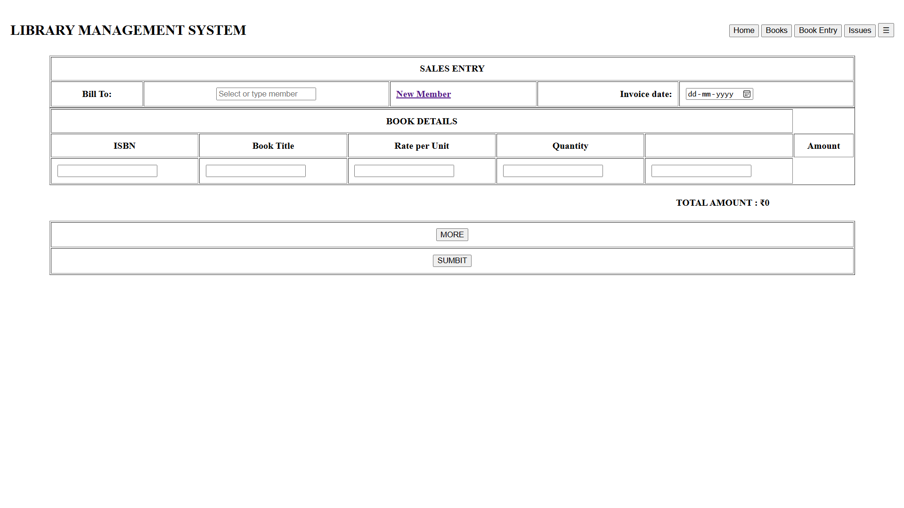 
#
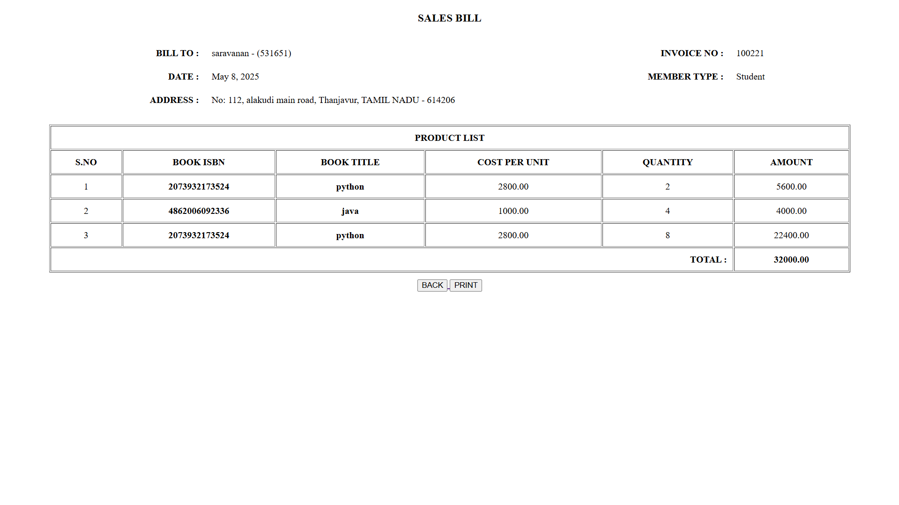 
#
 

#